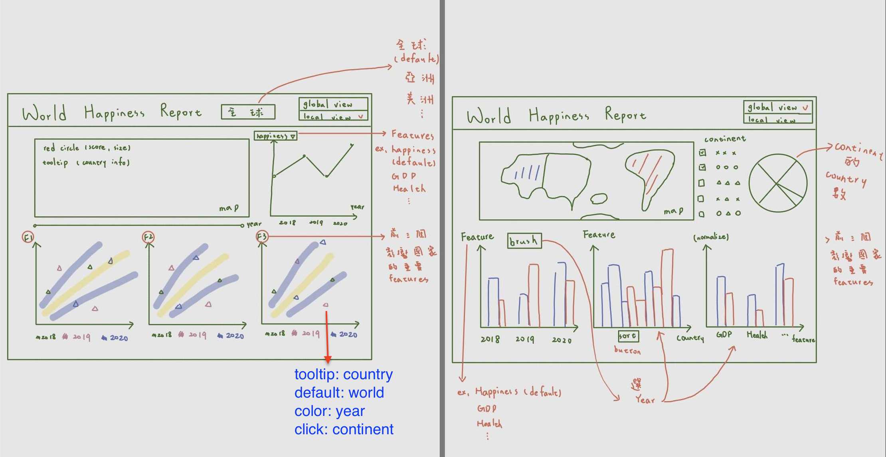

# DataVisualization
final project of data visualization

# Proposal

Dates: November 26, 2022
People: Anonymous, Anonymous, Anonymous, Anonymous
Status: Planning

# **Section 1: Basic information**

## Project title: Global Happiness Analysis

## Team members😀

- 張心瑜
    - 40847044S
    - asdfg335522@gmail.com
- 何昀潔
    - 40847037S
    - hoyunjie@gmail.com
- 盧萱
    - 40847003S
    - alice900531@gmail.com
- 張芩
    - 40847017S
    - changchin.sweety@gmail.com

## **Section 2: Overview**

- World Happiness Report uses global survey data to report how people evaluate their own lives in 132 countries worldwide. If we could understand what factor is driving the decline in happiness, it may help the United Nations to formulate appropriate policies, improve public welfare, and economic development. It can also help people choose the happiest country to immigrate.

## **Section3: Data and Data Processing**

## Dataset link:

- Provide a link to your data source or describe where and how to get the dataset.

[https://www.kaggle.com/datasets/eliasturk/world-happiness-based-on-cpi-20152020](https://www.kaggle.com/datasets/eliasturk/world-happiness-based-on-cpi-20152020)

## Variables used for visualization

We will be visualizing a dataset of 792 surveys. Each survey includes the happiness calculated through multiple factors (family, health, freedom, etc.). 

1. Country: Name of the country.
2. happiness_score: Average of responses to the primary life evaluation question from the Gallup World Poll (GWP). 0-10
3. gdp_per_capita: The extent to which GDP contributes to the calculation of the Happiness Score.
4. family: The extent to which Family contributes to the calculation of the Happiness Score
5. health: The extent to which Life expectancy contributed to the calculation of the Happiness Score
6. freedom: The extent to which Freedom contributed to the calculation of the Happiness Score.
7. generosity: A numerical value calculated based on poll participants' perceptions of generosity in their country.
8. government_trust: The extent to which Perception of Corruption contributes to Happiness Score.
9. dystopia_residual: A score based on a hypothetical comparison to the world's saddest country.
10. continent: Region of the country.
11. Year: Date of each of the findings.
12. social_support: Social support is the perception and actuality that one is cared for, has assistance available from other people, and most popularly, that one is part of a supportive social network.
13. cpi_score*:* Corruption perception index (the higher the better).

## Section 4: Usage scenarios & tasks

- Government officials budget for the coming year. Their goal is to improve public welfare; however, how to use a limited budget to achieve the highest efficacy is a big challenge. Understanding the factors leading to high happiness score can help them achieve this goal. Therefore, government officials can assign more budget to the specific field. For example, when the officials figure out that health contributes to happiness score the most, they can assign more money on health-related policy, such as long-term health care, food safety, and health care for rural areas.
- The United Nations want to help countries that have low happiness score to formulate proper policies. It can use the map in this visualization to find out countries with lowest happiness score and their cause.
- Mary is a retired teacher and she wants to choose the happiest country to immigrate by reference of this visualization.

## Section 5: Visualization Design & Sketch

### Section 6: Work breakdown and schedule

- Open Github ⇒ 12/2
- Header
    - Title  ⇒ 12/6
    - Global, Asia, America  ⇒ 12/9
    - global view, local view  ⇒ 12/9
- Map
    - show  ⇒ 12/9
    - tooltip  ⇒ 12/13
    - red circle (happiness score)  ⇒ 12/13
- line chart
    - show  ⇒ 12/9
    - feature extraction  ⇒ 12/19
- scatterplot
    - show  ⇒ 12/9
    - Top three features to impact the happiness score  ⇒ 12/19
- pie chart
    - show  ⇒ 12/6
    - the number of countries between continents  ⇒ 12/6
- bar chart
    - show  ⇒ 12/5
    - sort  ⇒ 12/10
    - brush  ⇒ 12/16
